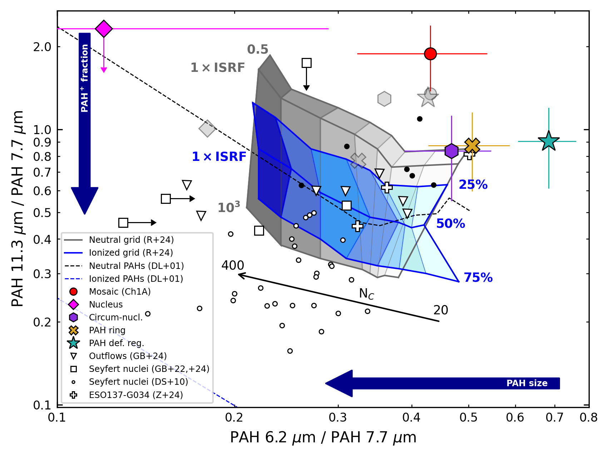
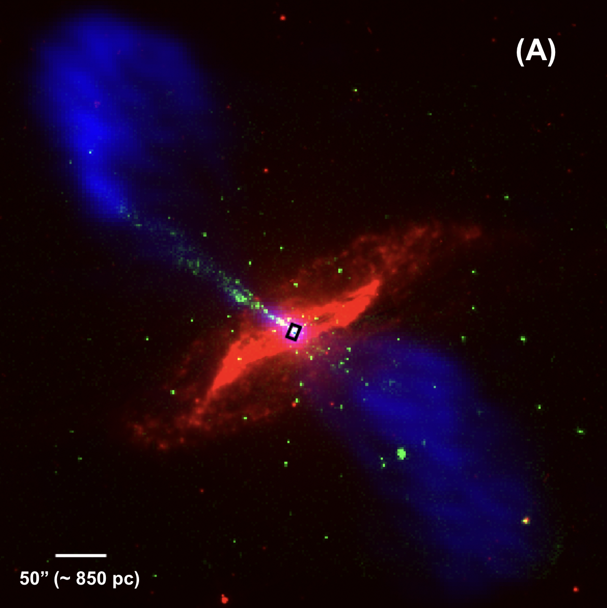
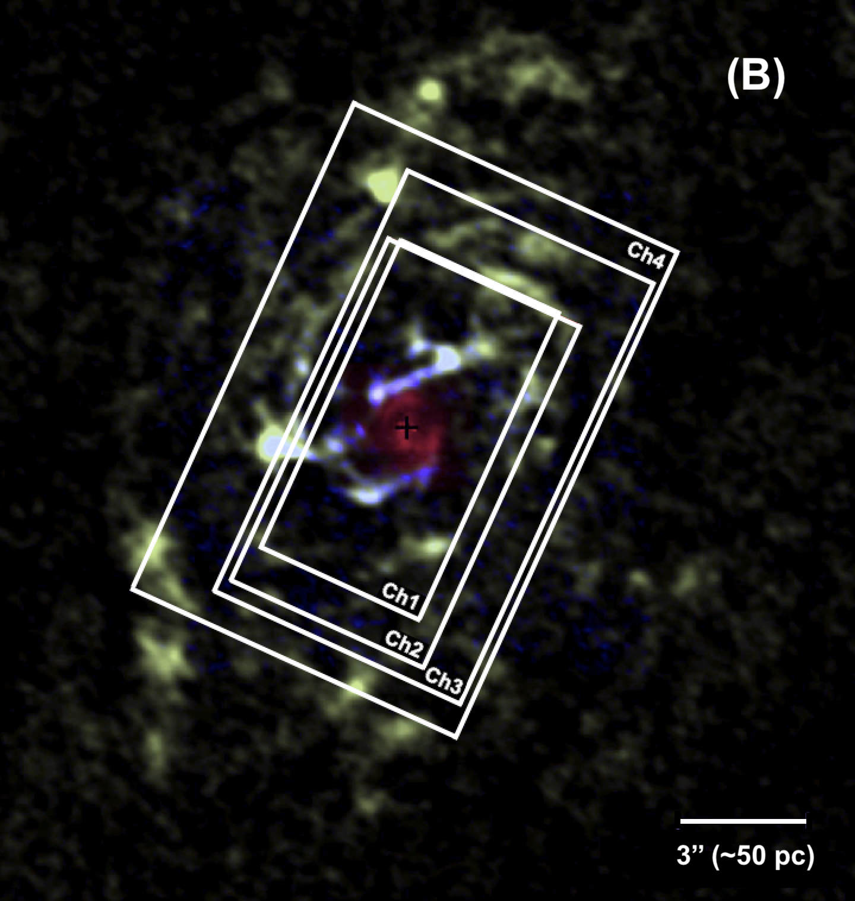
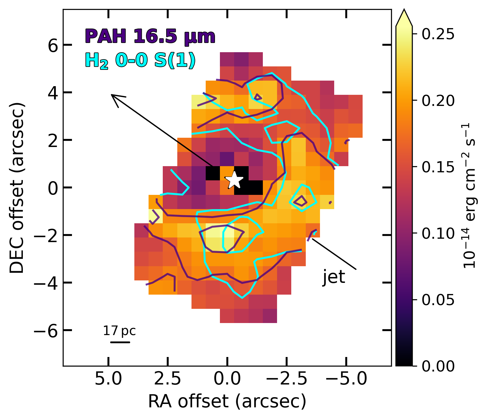
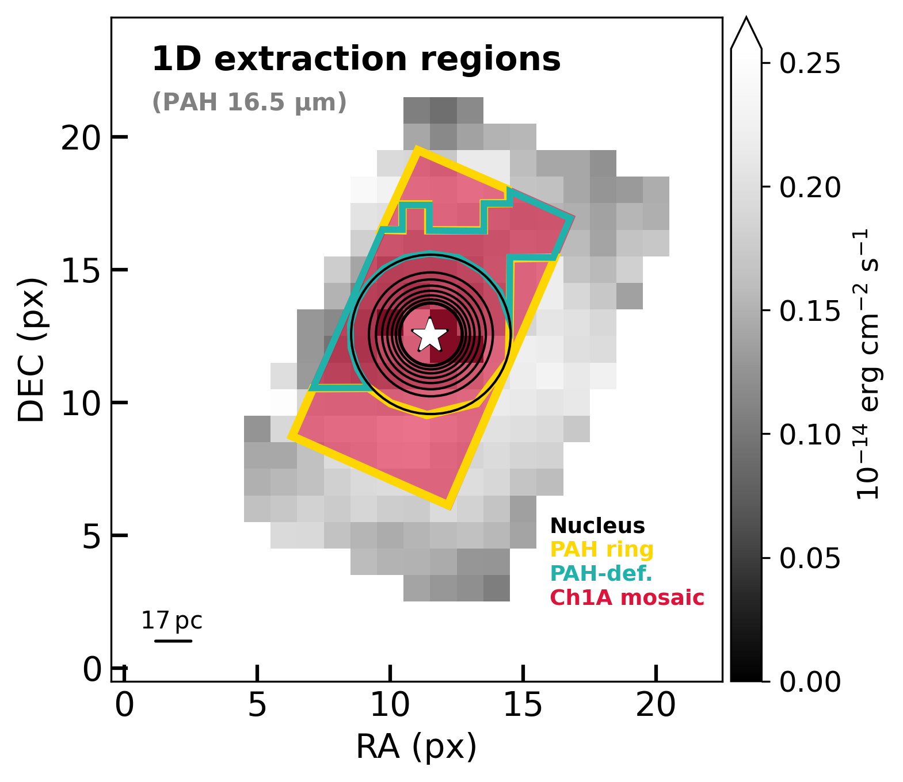

$\newcommand{\ensuremath}{}$
$\newcommand{\xspace}{}$
$\newcommand{\object}[1]{\texttt{#1}}$
$\newcommand{\farcs}{{.}''}$
$\newcommand{\farcm}{{.}'}$
$\newcommand{\arcsec}{''}$
$\newcommand{\arcmin}{'}$
$\newcommand{\ion}[2]{#1#2}$
$\newcommand{\textsc}[1]{\textrm{#1}}$
$\newcommand{\hl}[1]{\textrm{#1}}$
$\newcommand{\footnote}[1]{}$
$\newcommand{\change}[1]{{\color{MidnightBlue}#1}}$
$\newcommand{\arii}{[\ion{Ar}{ii}]\xspace}$
$\newcommand{\ariii}{[\ion{Ar}{iii}]\xspace}$
$\newcommand{\neii}{[\ion{Ne}{ii}]\xspace}$
$\newcommand{\neiii}{[\ion{Ne}{iii}]\xspace}$
$\newcommand{\nev}{[\ion{Ne}{v}]\xspace}$
$\newcommand{\oiv}{[\ion{O}{iv}]\xspace}$
$\newcommand{\siii}{[\ion{S}{iii}]\xspace}$
$\newcommand{\feii}{[\ion{Fe}{ii}]\xspace}$
$\newcommand{\clii}{[\ion{Cl}{ii}]\xspace}$
$\newcommand{\nevi}{[\ion{Ne}{vi}]\xspace}$
$\newcommand{\fevii}{[\ion{Fe}{vii}]\xspace}$
$\newcommand{\arv}{[\ion{Ar}{v}]\xspace}$
$\newcommand{\htwo}{H_2\xspace}$
$\newcommand{\halpha}{H\alpha\xspace}$
$\newcommand{\hii}{\ion{H}{ii}\xspace}$
$\newcommand{\fmol}{f_{\rm mol}\xspace}$
$\newcommand{\Pfa}{{Pf~\alpha}\xspace}$
$\newcommand{\spirit}{{\small SPIRIT}\xspace}$
$\newcommand{\cafe}{{\small CAFE}\xspace}$
$\newcommand{\pahfit}{{\small PAHFIT}\xspace}$
$\newcommand{\upmicron}{\upmum\xspace}$
$\newcommand{\tabupmicron}{\upmum}$
$\newcommand{\orcid}[1]{\href{https://orcid.org/#1}{\includegraphics[width=8pt]{orcid-ID.png}}}$

# MICONIC: JWST/MIRI-MRS reveals heavily reprocessed PAH emission in the circum-nuclear disc of Centaurus A

<mark>Appeared on: 2026-03-26</mark> -  _Accepted for publication in A&A. 14 pages, 10 figures; plus 5 pages and 4 figures in the appendices_

L. Pantoni, et al. -- incl., <mark>T. Henning</mark>, <mark>F. Walter</mark>

**Abstract:** Polycyclic Aromatic Hydrocarbons (PAHs) constitute essential components of dust in galaxies and have a fundamental role in the physics of the interstellar medium (ISM). The impact of AGN feedback on these molecules is still under debate. We present a detailed analysis of the spatially-resolved properties of PAHs in the central $7^{\prime\prime}\times12^{\prime\prime}$ ( $\sim100\times200$ pc $^2$ ) of Centaurus A (Cen A). We use the JWST/MIRI-MRS observations at $\lambda\sim5-28$  $\upmicron$ taken as part of the MIRI European consortium’s Guaranteed Time Observation (GTO) program MICONIC, with angular resolution between $0.35^{\prime\prime}$ and $1^{\prime\prime}$ ( $\sim6-17$ pc). We derive PAH moment-0 maps through local continuum subtraction and extract 1-dimensional spectra in five regions of interest, including the nucleus, the circum-nuclear disc, and a region characterized by a prominent deficiency in PAH emission. We decompose the spectra into continuum, emission lines and PAHs, from which we extract PAH intensities and EWs. PAH emission is predominantly distributed in a ring-like structure with localized intensity enhancements, at a radius of $\sim40$ pc from the active nucleus. Toward the North-West we observe a distinct PAH-deficient area, roughly perpendicular to the jet axis and coincident with enhanced ionized-gas velocity dispersion as well as inflowing warm and cold molecular streamers. The PAH 11.3/7.7 $\upmicron$ and 6.2/7.7 $\upmicron$ intensity ratios exceed model predictions for pericondensed PAHs, suggesting heavily reprocessed populations characterized by more open and irregular molecular structures.   PAH 11.3/12.7 $\upmicron$ ratios point to a prevalence of solo over duo or trio hydrogen sites, consistent with a non-negligible degree of dehydrogenation, particularly within the PAH-deficient region, where shock-driven erosion may play a major role. We measure the largest EWs in the PAH ring, whereas reduced values in the PAH-deficient region likely reflect partial destruction by shocks; in the nucleus, the small EWs are largely attributable to continuum dilution.

**Figure 10. -** PAH 11.3/7.7 $\upmicron$ versus PAH 6.2/7.7 $\upmicron$ diagnostic plot for the five regions of interest: full Ch 1A mosaic (red circle), nucleus (magenta diamond), circum-nuclear region (violet hexagon), PAH ring (yellow cross), and PAH-deficient region (green star).
      The large uncertainty on the nuclear PAH 6.2/7.7 $\upmicron$ ratio and the and the upper limit on 11.3/7.7 $\upmicron$ result from partial detection of the 6.2 and 7.7 $\upmicron$ features (Appendix \ref{App:nucleus}). Grey symbols show $\cafe$-derived ratios (Appendix \ref{App:cafe}). Uncertainties on the $\cafe$ ratios, which span nearly the full x-range of the figure while remaining close to the $\spirit$ y-axis values, were omitted for clarity. We overlay the grids of [Rigopoulou, et. al (2021)](https://ui.adsabs.harvard.edu/abs/2021MNRAS.504.5287R) for neutral PAHs (grey; illuminated by $0.5-10^3$ ISRF), and partially ionized PAHs ($25-75$\%; blue; 1 ISRF). PAH size increases along the x-axis (right to left) with the number of carbon atoms ($N_C$) while the ionized fraction increases along the y-axis (top to bottom). The dashed black and blue curves mark the neutral and ionized PAH limits from [Draine and Li (2001)](https://ui.adsabs.harvard.edu/abs/2001ApJ...551..807D), for 1 ISRF.
      For comparison, we include PAH ratios for Seyfert nuclei from \citet[][circles; filled symbols indicate high $\htwo$/PAH luminosity ratios]{Diamond-Stanic2010ApJ...724..140D}; and from [Garc\'\ia-Bernete, et. al (2022)](https://ui.adsabs.harvard.edu/abs/2022A&A...666L...5G), [Garc\'\ia-Bernete, et. al (2024)](https://ui.adsabs.harvard.edu/abs/2024A&A...691A.162G), shown as squares.
      Triangles denote outflow regions in the same systems. Plus symbols represent the three regions in the central kpc of the Seyfert 2 ESO 137-G034  ([Zhang, et. al 2024](https://ui.adsabs.harvard.edu/abs/2024ApJ...975L...2Z)) . For clarity, we omit the uncertainties associated with literature ratios.
       (*Fig:PAHratio_d1*)

**Figure 6. -** Panel A: RGB composite image of Cen A. Red colour shows the 5.8 $\upmicron$ emission from Cen A as observed by Spitzer/IRAC  ([Quillen, et. al 2006](https://doi.org/10.1086/504418), [Quillen, et. al 2006](https://doi.org/10.1086/503670)) ; green colour corresponds to X-ray emission observed with Chandra/ACIS  ([Hardcastle, et. al 2007](https://ui.adsabs.harvard.edu/abs/2007ApJ...670L..81H)) ; and blue colour traces the radio jet structure imaged with the VLA  ([Hardcastle, et. al 2003](https://ui.adsabs.harvard.edu/abs/2003ApJ...593..169H)) . In black we show the footprint of MIRI-MRS observations. Panel B: Zoom-in on the central few hundred parsecs of Cen A, showing cold molecular gas traced by CO(6--5) and CO(3--2) in blue and green colours, and the VLT/SINFONI $\htwo$ 1-0 S(1) intensity map by [Neumayer, et. al (2007)](https://ui.adsabs.harvard.edu/abs/2007ApJ...671.1329N) in red \citep[adapted from][]{Espada2017ApJ...843..136E}. White rectangles mark the each MIRI-MRS mosaic of $1\times2$ FoV \citep[adapted from][]{Evangelista2026}. North is up, East is to the left.
       (*Fig:CenA_comp*)

**Figure 8. -** Left: mom0 map of the PAH 16.5 $\upmicron$ feature in the nuclear region of Cen A at $0.65^{\prime\prime}$ resolution ($\sim11$ pc), obtained after subtraction of the local continuum. Violet contours show the PAH emission at levels of $(0.2,0.25)\times10^{-14}$ erg cm$^{-2}$ s$^{-1}$. Cyan contours trace the $\htwo$ 0-0 S(1) 17.03 $\upmicron$ rotational line at levels of $(0.19,0.23)\times10^{-14}$ erg cm$^{-2}$ s$^{-1}$. The black arrows indicate the position angle of the jet (i.e., PA$_{\rm jet}=51 $deg). Bright pixels near the AGN position are artifacts resulting from the local continuum subtraction. Right: 1D extraction regions defined within the Ch 1A mosaic (red filled area), overlaid on the PAH 16.5 $\upmicron$ surface density map (greyscale): nucleus (concentric circular areas in black), PAH ring (yellow), PAH-deficient region (green). The circum-nuclear region is defined as the full Ch 1A mosaic minus the nuclear emission. In both panels, the star marks the peak of the continuum, corresponding to the position of the AGN. The [0,0] point on the axes (pixel [11,12]) denotes the centre of the sub-channel array (Ch 3C). North is up, and East is to the left.
       (*Fig:PAH16p5*)

