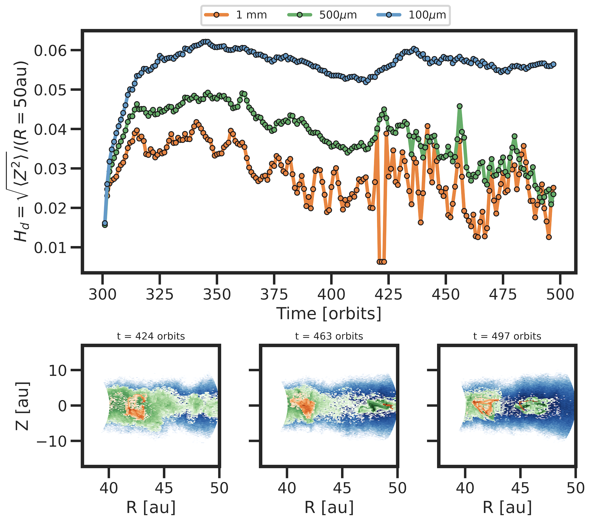
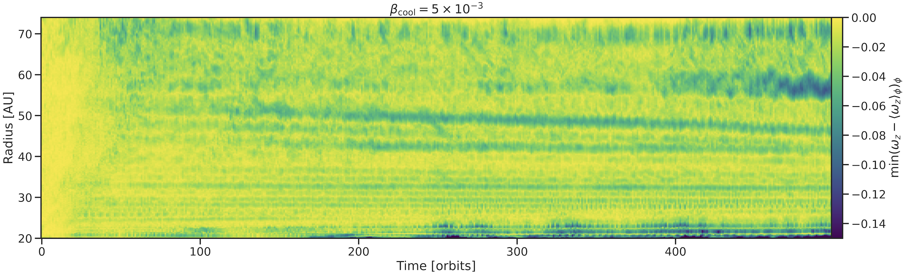
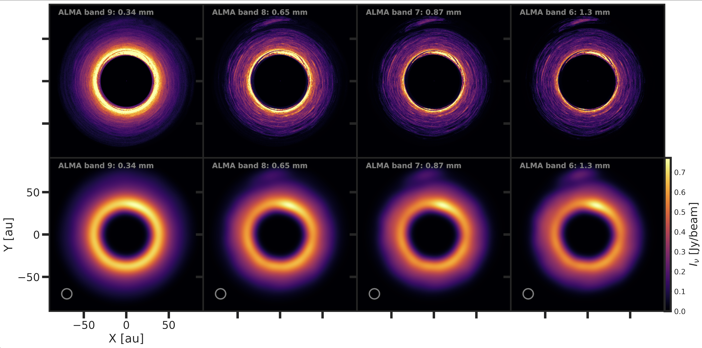

$\newcommand{\ensuremath}{}$
$\newcommand{\xspace}{}$
$\newcommand{\object}[1]{\texttt{#1}}$
$\newcommand{\farcs}{{.}''}$
$\newcommand{\farcm}{{.}'}$
$\newcommand{\arcsec}{''}$
$\newcommand{\arcmin}{'}$
$\newcommand{\ion}[2]{#1#2}$
$\newcommand{\textsc}[1]{\textrm{#1}}$
$\newcommand{\hl}[1]{\textrm{#1}}$
$\newcommand{\footnote}[1]{}$

# Gas dynamics around dust asymmetries in turbulent disks

<mark>Appeared on: 2026-03-26</mark> -  _19 pages, 18 figures, accepted for publication in A&A_

L. Flores-Rivera, et al. -- incl., <mark>M. Flock</mark>, <mark>H. Klahr</mark>

**Abstract:** High-resolution ALMA observations have revealed asymmetric dust crescents in several protoplanetary disks, suggesting efficient dust trapping mechanisms potentially linked to gas vortices. While such features have been associated with vortices—whether induced by massive planets, turbulence, or other disk processes—their origin remains unclear. In this study, we investigate the viability of dust trapping by vortices that are self-sustained in disks dominated by Vertical Shear Instability (VSI) turbulence. We perform 3D hydrodynamic simulations using the PLUTO code with Lagrangian particles of three sizes (1 mm, 500 $\mu$ m, 100 $\mu$ m) to analyze the gas–dust dynamics around vortices. Our simulations reveal the formation of multiple vortices, including two characteristic large-scale, long-lived vortices that are able to capture the dust particles. We also find that dust vertical diffusion is reduced within vortices, suggesting that these structures preferentially enhance radial and azimuthal motions. Finally we generate synthetic dust continuum images at different wavelength bands and velocity residuals to compare the observable properties with ALMA observations. No clear spiral features are observed in either the synthetic dust images or the velocity residuals, unlike in vortices triggered by planets. Projection effects at high disk inclinations can obscure dust asymmetries, implying that more disks may host dust crescents than currently reported.

**Figure 11. -** Dust scale height over time for all particles species. The dust scale height is radially averaged from 40 au to 50 au. Each marker represents the averaged dust scale height calculated by taking the rms of the vertical position of the particles for all sizes per orbit. Strong vertical fluctuations are observed for the 1 mm and 500 $\mu$m grain sizes after approximately 424 orbits. This corresponds to a regime where the dust distribution is characterized by localized and compact concentrations within vortices (see the orange region in the bottom three panels at three different snapshots). (*fig:dust_scale_height_over_time*)

**Figure 7. -** Time evolution of the minimum vorticity residual as a function of radius, illustrating the radial position and migration of vortices in the VSI-unstable disk. The horizontal dashed lines outline the final locations of the two large scale vortices. (*fig:vort_residual*)

**Figure 12. -** Synthetic images of the simulated disk at 0$^{\circ}$ inclination. Top row shows the brightness of the simulated disk after radiative transfer for four different ALMA wavelength bands (columns). Bottom row shows the convolution of the disk images using a circular beam with the FWHM of 12 au ($\sigma_\mathrm{beam}$ = 5 au). Overall, the presence of two asymmetric dust features are clearly seen at the inner ring and in the outer parts of the dust continuum emission. The inner one is found to be at the same location as the dust concentration. (*fig:radtrans_0incl*)

