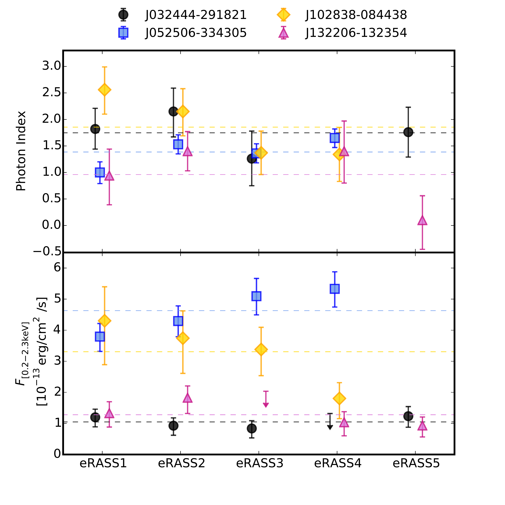
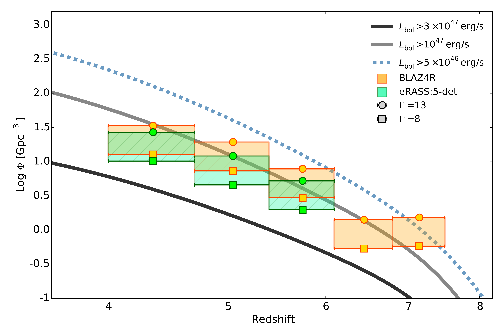
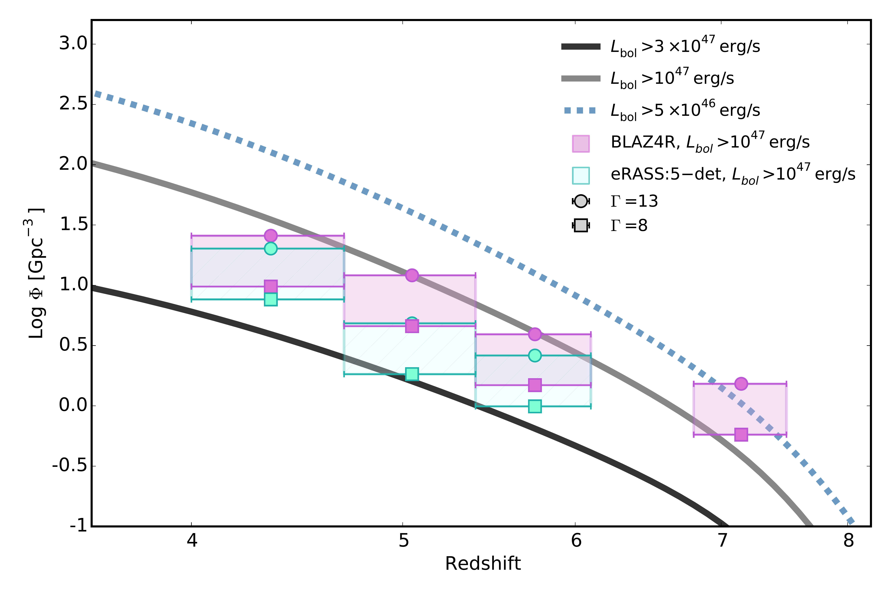
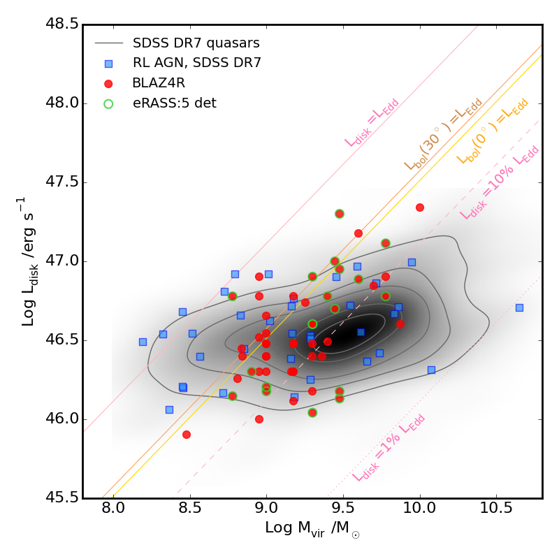

$\newcommand{\ensuremath}{}$
$\newcommand{\xspace}{}$
$\newcommand{\object}[1]{\texttt{#1}}$
$\newcommand{\farcs}{{.}''}$
$\newcommand{\farcm}{{.}'}$
$\newcommand{\arcsec}{''}$
$\newcommand{\arcmin}{'}$
$\newcommand{\ion}[2]{#1#2}$
$\newcommand{\textsc}[1]{\textrm{#1}}$
$\newcommand{\hl}[1]{\textrm{#1}}$
$\newcommand{\footnote}[1]{}$
$\newcommand{\arraystretch}{1.1}$
$\newcommand{\arraystretch}{1.5}$
$\newcommand{\arraystretch}{1.3}$
$\newcommand{\arraystretch}{1.1}$

# BLAZ4R and the eROSITA view of $z>4$ blazars

<mark>Appeared on: 2026-03-27</mark> -  _Submitted to A&A. Catalog available at this https URL_

T. Sbarrato, et al. -- incl., <mark>S. Belladitta</mark>, <mark>J. Wolf</mark>

**Abstract:** We present  BLAZ4R, the first living catalog of confirmed $z>4$ blazars, with a focus on the contribution of eROSITA, on board of the Spectrum Roentgen Gamma (SRG) spacecraft.   Blazars at $z>4$ are rare but powerful probes of how active supermassive black holes evolve in connection to relativistic jets, in the first 2 billion years of cosmic history.   At these redshifts, X-ray observations are essential for constraining blazars jet power and orientation, enabling effective trace of their parent population.   The all-sky surveys   provided by eROSITA ensure X-ray detection for  BLAZ4R sources and, in some cases, allow spectral and temporal studies of their jetted emission.    BLAZ4R includes 54 confirmed blazars, characterized through their X-ray properties, radio spectra and morphology, and multiwavelength profiles.   We confirm that jetted sources are significantly more numerous relative to non-jetted counterparts at high- $z$ , and that blazars (and therefore the overall jetted population) do not exhibit significantly different features compared to the total active galactic nuclei population in the early Universe.   Fast accretion processes that involve relativistic jets are clearly required to justify the existence of fully formed jetted AGN at $z>4$ . However, the diverse multiwavelength properties characterizing  BLAZ4R do not yet allow us to identify the specific signatures of these processes.   We will continue updating  BLAZ4R to search for such signatures and ultimately understand the early formation of jetted AGN.

**Figure 3. -** eROSITA photon index (top panel) and X-ray flux
               in the 0.2-2.3 keV range (bottom panel)
               of the 4 sources with more than 80 counts,
               as a function of the eRASS scan
               (i.e. roughly function of time), as labelled.
               The horizontal dashed lines show the mean value of each source (photon index or flux, in the respective panels) as color-coded, calculated excluding upper limits.
               (*Fig:variability*)

**Figure 5. -** Comoving number densities of active black holes
               hosted in jetted AGN traced by blazars at $z>4$,
               as a function of redshift.
               $\Phi(z)$ is derived for the jetted population by assuming
               a bulk Lorentz factor of $\Gamma=13$ or 8
               (circles or squares respectively).
               The upper figure shows the results for the whole sample, while the lower is limited to $L_{\rm bol}>10^{47}$erg/s.
               In both figures, differently colored data points and shaded intervals refers to the total $z>4$ sample (orange in the top figure, purple in the bottom one), and the eRASS:5 detected only (green and light blue).
               The curves show the space densities for the overall
               massive AGN population as extracted from [Shen, et. al (2020)](https://ui.adsabs.harvard.edu/abs/2020MNRAS.495.3252S),
               integrated starting from a bolometric luminosity of
               $5\times10^{46}, 10^{47}$ and $3\times10^{47}$ erg/s
               (dashed blue, solid grey and solid black lines).
               (*Fig:Phi-zoom*)

**Figure 6. -** Disk luminosity as a function of black hole mass measures for our blazar sample
               (filled red circles, circled in green if detected by eRASS:5), compared with $z>4$ SDSS DR7 quasars (grey contours) and $z>4$ SDSS DR7 radio-loud quasars (blue squares).
               Notably, there is no significant difference in SMBH mass and accretion between confirmed blazars and the overall population traced by the SDSS survey.
               (*Fig:mass-luminosity*)

