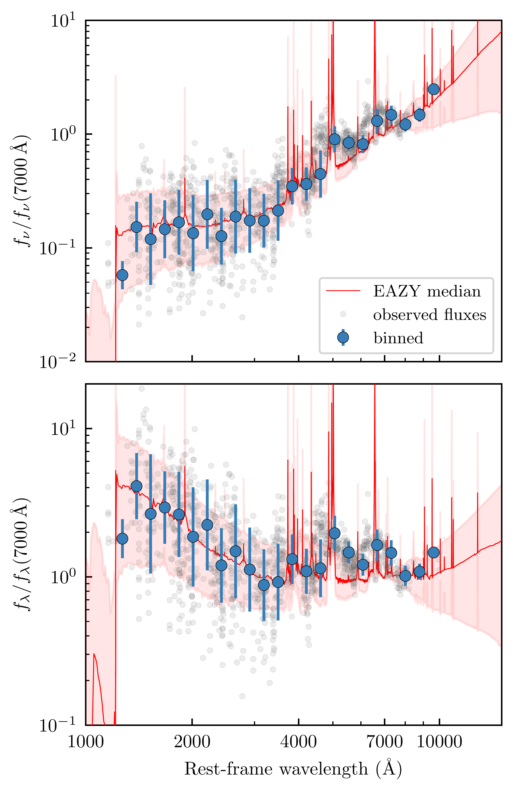
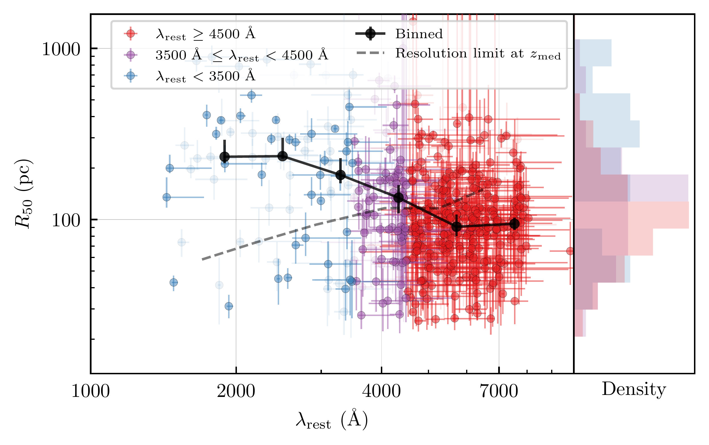
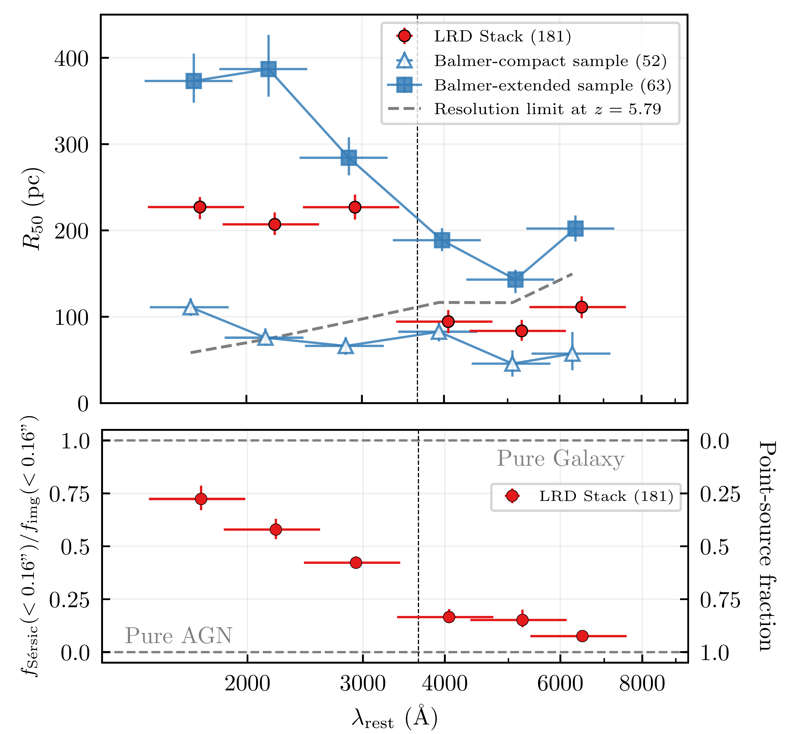

$\newcommand{\ensuremath}{}$
$\newcommand{\xspace}{}$
$\newcommand{\object}[1]{\texttt{#1}}$
$\newcommand{\farcs}{{.}''}$
$\newcommand{\farcm}{{.}'}$
$\newcommand{\arcsec}{''}$
$\newcommand{\arcmin}{'}$
$\newcommand{\ion}[2]{#1#2}$
$\newcommand{\textsc}[1]{\textrm{#1}}$
$\newcommand{\hl}[1]{\textrm{#1}}$
$\newcommand{\footnote}[1]{}$
$\newcommand$
$\newcommand$
$\newcommand{\jcap}{\ref@jnl{JCAP}}$
$\newcommand{\NEW}[1]{\textcolor{blue}{#1}}$
$\newcommand{\vdag}{(v)^\dagger}$
$\newcommand$
$\newcommand$
$\newcommand{\red}{\textcolor{red}}$
$\newcommand{\bhs}{BH*\xspace}$
$\newcommand{\ruv}{R_{50, \rm UV}}$
$\newcommand{\ropt}{R_{50, \rm opt}}$
$\newcommand{\panoramic}{{PANORAMIC}\xspace}$
$\newcommand{\hst}{\textit{HST}\xspace}$
$\newcommand{\jwst}{\textit{JWST}\xspace}$
$\newcommand{\nircam}{{NIRCam}\xspace}$
$\newcommand{\zrange}{{z \sim 4-9}\xspace}$
$\newcommand{\sersic}{{Sérsic}\xspace}$
$\newcommand{\numpy}{\code{NumPy}}$
$\newcommand{\scipy}{\code{SciPy}}$
$\newcommand{\matplotlib}{\code{matplotlib}}$
$\newcommand{\astropy}{\code{Astropy}}$
$\newcommand{\photutils}{\code{photutils}}$
$\newcommand{\galfit}{{GALFIT}\xspace}$
$\newcommand{\pysersic}{\code{pysersic}}$
$\newcommand{\dsnine}{{SAO Image DS9}\xspace}$
$\newcommand{\stpsf}{\code{STPSF}}$
$\newcommand{\ie}{i.e.\xspace}$
$\newcommand{\eg}{e.g.\xspace}$
$\newcommand{\etc}{etc.\xspace}$
$\newcommand{\etal}{et al.\xspace}$
$\newcommand{\vs}{vs.\xspace}$
$\newcommand{\super}[1]{\ensuremath{^{\textrm{#1}}}}$
$\newcommand{\sub}[1]{\ensuremath{_{\textrm{#1}}}}$
$\newcommand{\CHECK}[1]{{\textcolor{orange}{#1}}}$
$\newcommand{\COMMENT}[1]{{\it \textcolor{blue}{(Comment: #1)}}}$
$\newcommand{\NOTE}[1]{\textcolor{blue}{(#1)}}$
$\newcommand{\highlight}[1]{\sethlcolor{yellow}\hl{#1}}$
$\newcommand{\response}[1]{{\bf \textcolor{red}{#1}}}$
$\newcommand{\IT}{{I\&T}\xspace}$
$\newcommand{\sectionfootnote}[2]{$
$  \newcommand{\thefootnote}{\fnsymbol{footnote}}$
$  \section[#1]{#1 ^\dagger}$
$  \footnotetext[2]{#2}$
$  \setcounter{footnote}{0}$
$  \newcommand{\thefootnote}{\arabic{footnote}}$
$}$
$\newcommand{\vect}[1]{\boldsymbol{#1}}$
$\newcommand{\roughly}{\ensuremath{ {\sim} } }$
$\newcommand{\gtr}{\ensuremath{ {>} } }$
$\newcommand{\less}{\ensuremath{ {<} } }$
$\newcommand{\doublehat}[1]{$
$    \settoheight{\dhatheight}{\ensuremath{\hat{#1}}}$
$    \addtolength{\dhatheight}{-0.35ex}$
$    \hat{\vphantom{\rule{1pt}{\dhatheight}}$
$    \smash{\hat{#1}}}}$
$\newcommand{\code}[1]{\texttt{#1}\xspace}$
$\newcommand{\dd}{\ensuremath{\rm d}}$
$\newcommand{\unit}[1]{\ensuremath{\mathrm{ #1}}\xspace}$
$\newcommand{\yr}{\unit{yr}}$
$\newcommand{\Gyr}{\unit{Gyr}}$
$\newcommand{\Myr}{\unit{Myr}}$
$\newcommand{\eV}{\unit{eV}}$
$\newcommand{\keV}{\unit{keV}}$
$\newcommand{\MeV}{\unit{MeV}}$
$\newcommand{\GeV}{\unit{GeV}}$
$\newcommand{\TeV}{\unit{TeV}}$
$\newcommand{\MB}{\unit{MB}}$
$\newcommand{\GB}{\unit{GB}}$
$\newcommand{\TB}{\unit{TB}}$
$\newcommand{◦ee}{\ensuremath{ ^{\circ}}\xspace}$
$\newcommand{◦ees}{◦ee}$
$\newcommand{\mas}{\unit{mas}}$
$\newcommand{\amin}{\unit{arcmin}}$
$\newcommand{\asec}{\unit{arcsec}}$
$\newcommand{\angstrom}{\unit{Å}}$
$\newcommand{\um}{\unit{\mum}}$
$\newcommand{\cm}{\unit{cm}}$
$\newcommand{\km}{\unit{km}}$
$\newcommand{\kms}{\km \second^{-1}}$
$\newcommand{\pc}{\unit{pc}}$
$\newcommand{\kpc}{\unit{kpc}}$
$\newcommand{\second}{\unit{s}}$
$\newcommand{\us}{\unit{\mus}}$
$\newcommand{\photons}{\unit{ph}}$
$\newcommand{\photon}{\unit{ph}}$
$\newcommand{\sr}{\unit{sr}}$
$\newcommand{\Msolar}{\unit{M_\odot}}$
$\newcommand{\Msun}{M_\odot}$
$\newcommand{\Msunyr}{\Msun\yr^{-1}}$
$\newcommand{\Lsolar}{\unit{L_\odot}}$
$\newcommand{\Lsun}{L_\odot}$
$\newcommand{\Lstar}{\unit{L_{*}}}$
$\newcommand{\Lum}{\ensuremath{ L }\xspace}$
$\newcommand{\Dsun}{\unit{D_\odot}}$
$\newcommand{\Dgc}{\ensuremath{D_{GC}}\xspace}$
$\newcommand{\Rgc}{\ensuremath{R_{GC}}\xspace}$
$\newcommand{\cmcubes}{\ensuremath{\cm^{3}\second^{-1}}\xspace}$
$\newcommand{\magn}{\unit{mag}}$
$\newcommand{\mmag}{\unit{mmag}}$
$\newcommand{\e}{\unit{e^{-}}}$
$\newcommand{\rms}{\unit{rms}}$
$\newcommand{\pix}{\unit{pix}}$
$\newcommand{\rmspix}{\unit{rms/pix}}$
$\newcommand{\ermspix}{\e \rmspix}$
$\newcommand{\Mv}{\ensuremath{M_{V}}\xspace}$
$\newcommand{\secref}[1]{Section~\ref{sec:#1}}$
$\newcommand{\appref}[1]{Appendix~\ref{app:#1}}$
$\newcommand{\tabref}[1]{Table~\ref{tab:#1}}$
$\newcommand{\tabrefs}[2]{Tables~\ref{tab:#1} and \ref{tab:#2}}$
$\newcommand{\figref}[1]{Figure~\ref{fig:#1}}$
$\newcommand{\figrefs}[2]{Figures~\ref{fig:#1} and \ref{fig:#2}}$
$\newcommand{\eqnref}[1]{Equation~\eqref{eqn:#1}}$
$\newcommand{\bandvar}[2][]{$
$  \ifthenelse{\isempty{#1}}{\var{#2}}{\var{#2\_#1}}$
$}$
$\newcommand{\spreadmodel}[1][]{\bandvar[#1]{spread\_model}}$
$\newcommand{\spreaderrmodel}[1][]{\bandvar[#1]{spreaderr\_model}}$
$\newcommand{\wavgspreadmodel}[1][]{\bandvar[#1]{wavg\_spread\_model}}$
$\newcommand{\classstar}[1][]{\bandvar[#1]{class\_star}}$
$\newcommand{\magauto}[1][]{\bandvar[#1]{mag\_auto}}$
$\newcommand{\magpsf}[1][]{\bandvar[#1]{mag\_psf}}$
$\newcommand{\magerrpsf}[1][]{\bandvar[#1]{magerr\_psf}}$
$\newcommand{\flags}[1][]{\bandvar[#1]{flags}}$
$\newcommand{\LCDM}{\ensuremath{\rm \Lambda CDM}\xspace}$
$\newcommand{\modulus}{\ensuremath{m - M}\xspace}$
$\newcommand{\mM}{\modulus}$
$\newcommand{\ra}{{\ensuremath{\alpha_{2000}}}\xspace}$
$\newcommand{\dec}{{\ensuremath{\delta_{2000}}}\xspace}$
$\newcommand{\age}{{\ensuremath{\tau}}\xspace}$
$\newcommand{\metal}{{\ensuremath{Z}}\xspace}$
$\newcommand{\major}{\ensuremath{a_h}\xspace}$
$\newcommand{\nobjs}{{sixteen}\xspace}$
$\newcommand{\feh}{{\ensuremath{\rm[Fe/H]}}\xspace}$
$\newcommand{\ellip}{\ensuremath{\epsilon}\xspace}$
$\newcommand{\PA}{\ensuremath{\mathrm{P.A.}}\xspace}$
$\newcommand{\TS}{\ensuremath{\mathrm{TS}}\xspace}$
$\newcommand{\ngmix}{\code{ngmix}}$
$\newcommand{\SWARP}{\code{SWarp}}$
$\newcommand{\swarp}{\SWARP}$
$\newcommand{\SExtractor}{\code{SExtractor}}$
$\newcommand{\sextractor}{\SExtractor}$
$\newcommand{\PSFex}{\code{PSFex}}$
$\newcommand{\Astromatic}{\code{Astromatic}}$
$\newcommand{\HEALPix}{\code{HEALPix}}$
$\newcommand{\healpix}{\HEALPix}$
$\newcommand{\healpy}{\code{healpy}}$
$\newcommand{\DAOPHOT}{\code{DAOPHOT}}$
$\newcommand{\PARSEC}{\code{PARSEC}}$
$\newcommand{\mangle}{\code{mangle}}$
$\newcommand{\emcee}{\code{emcee}}$
$\newcommand{\ugali}{\code{ugali}}$
$\newcommand{\simple}{\code{simple}}$
$\newcommand{\var}[1]{\ensuremath{\texttt{\MakeUppercase{#1}}}\xspace}$
$\newcommand{\nside}{\code{nside}}$
$\newcommand{\prior}{\ensuremath{\mathcal{P}}\xspace}$
$\newcommand{\Prob}{\ensuremath{\mathcal{P}}\xspace}$
$\newcommand{\ProbJ}{\ensuremath{\mathcal{P}(J)}\xspace}$
$\newcommand{\like}{\ensuremath{\mathcal{L}}\xspace}$
$\newcommand{\plike}{\like_p\xspace}$
$\newcommand{\jlike}{\ensuremath{L}\xspace}$
$\newcommand{\pjlike}{\jlike_p\xspace}$
$\newcommand{\pseudolike}{ {\tilde{\like}} \xspace}$
$\newcommand{\loglike}{\ensuremath{\log\like}\xspace}$
$\newcommand{\logpseudolike}{\ensuremath{\log\pseudolike}\xspace}$
$\newcommand{\lnlike}{\ensuremath{\ln\like}\xspace}$
$\newcommand{\lnpseudolike}{\ensuremath{\ln\pseudolike}\xspace}$
$\newcommand{\given}{\ensuremath{  |  }\xspace}$
$\newcommand{\likefn}[2]{\ensuremath{ \like(#1 \given #2) }\xspace}$
$\newcommand{\plikefn}[2]{\ensuremath{ \plike(#1 \given #2) }\xspace}$
$\newcommand{\jlikefn}[2]{\ensuremath{ \jlike(#1 \given #2) }\xspace}$
$\newcommand{\data}{ \ensuremath{ \mathcal{D} }\xspace }$
$\newcommand{\param}{\ensuremath{{\theta}}\xspace}$
$\newcommand{\params}{\ensuremath{\vect{\theta}}\xspace}$
$\newcommand{\sig}{\ensuremath{\mu}\xspace}$
$\newcommand{\bkg}{\ensuremath{\eta}\xspace}$
$\newcommand{\interest}{\ensuremath{\vect{\sig}}\xspace}$
$\newcommand{\nuisance}{\ensuremath{\vect{\bkg}}\xspace}$
$\newcommand{\signal}{\sig}$
$\newcommand{\pvalue}{\textit{p}-value\xspace}$
$\newcommand{\pdf}{PDF\xspace}$
$\newcommand{\uspatial}{\ensuremath{u_s}}$
$\newcommand{\ucolor}{\ensuremath{u_c}}$
$\newcommand{\Jlike}{\ensuremath{\like_{J}}\xspace}$
$\newcommand{\Jsigma}{\ensuremath{\sigma_{i}}\xspace}$
$\newcommand{\Jtrue}{\Ji}$
$\newcommand{\Jobs}{\barJi}$
$\newcommand{\logtenJtrue}{\logtenJi}$
$\newcommand{\logtenJobs}{\barlogtenJi}$
$\newcommand{\Ji}{\ensuremath{J_i}\xspace}$
$\newcommand{\barJi}{\ensuremath{ {\overline{J_i}} }\xspace}$
$\newcommand{\logJi}{\ensuremath{{\log{(J_i)}}}\xspace}$
$\newcommand{\barlogJi}{\ensuremath{ {\overline{\log{(J_i)}}} }\xspace}$
$\newcommand{\logtenJi}{\ensuremath{{\log_{10}{(J_i)}}}\xspace}$
$\newcommand{\barlogtenJi}{\ensuremath{ {\overline{\log_{10}{(J_i)}}} }\xspace}$
$\newcommand{\ScienceTools}{\code{ScienceTools}}$
$\newcommand{\Sourcelike}{\code{Sourcelike}}$
$\newcommand{\gtlike}{\code{gtlike}}$
$\newcommand{\pointlike}{\code{pointlike}}$
$\newcommand{\Gtlike}{\code{Gtlike}}$
$\newcommand{\gtobssim}{\code{gtobssim}}$
$\newcommand{\DMFIT}{\code{DMFIT}}$
$\newcommand{\Pythia}{\code{Pythia}}$
$\newcommand{\GALPROP}{\code{GALPROP}}$
$\newcommand{\DM}{\ensuremath{\mathrm{DM}}}$
$\newcommand{\mDM}{\ensuremath{m_\DM}\xspace}$
$\newcommand{\mLSP}{\ensuremath{m_\LSP}\xspace}$
$\newcommand{\mChi}{\ensuremath{m_\chi}\xspace}$
$\newcommand{\sigmav}{\ensuremath{\langle \sigma v \rangle}\xspace}$
$\newcommand{\sigmavmax}{\ensuremath{\sigmav_{\max}}\xspace}$
$\newcommand{\sigmavT}{\ensuremath{\sigmav_{\rm T}}\xspace}$
$\newcommand{\tsigmav}{\ensuremath{\sigmav R^{2}}\xspace}$
$\newcommand{\LSP}{\ensuremath{\chi}\xspace}$
$\newcommand{\PhiPP}{\ensuremath{\Phi_{\rm PP}}\xspace}$
$\newcommand{\uubar}{\ensuremath{u \bar u}\xspace}$
$\newcommand{\ddbar}{\ensuremath{d \bar d}\xspace}$
$\newcommand{çbar}{\ensuremath{c \bar c}\xspace}$
$\newcommand{\ssbar}{\ensuremath{s \bar s}\xspace}$
$\newcommand{\bbbar}{\ensuremath{b \bar b}\xspace}$
$\newcommand{\ttbar}{\ensuremath{t \bar t}\xspace}$
$\newcommand{\ww}{\ensuremath{W^{+}W^{-}}\xspace}$
$\newcommand{\zz}{\ensuremath{Z^{0}Z^{0}}\xspace}$
$\newcommand{\gluglu}{\ensuremath{gg}\xspace}$
$\newcommand{\ee}{\ensuremath{e^{+}e^{-}}\xspace}$
$\newcommand{\mumu}{\ensuremath{\mu^{+}\mu^{-}}\xspace}$
$\newcommand{\tautau}{\ensuremath{\tau^{+}\tau^{-}}\xspace}$
$\newcommand{\relic}{\ensuremath{3\times10^{-26}\cm^{3}\second^{-1}}\xspace}$
$\newcommand{\Jfactor}{J-factor\xspace}$
$\newcommand{\Jfactors}{J-factors\xspace}$
$\newcommand{\JFactor}{J-Factor\xspace}$
$\newcommand{\Rmax}{\ensuremath{R_{V_{\rm max}}}\xspace}$
$\newcommand{\Vmax}{\ensuremath{V_{\rm max}}\xspace}$
$\newcommand{\rs}{\ensuremath{ r_{\rm s} }\xspace}$
$\newcommand{\rhos}{\ensuremath{ \rho_0 }\xspace}$
$\newcommand{\alphahalf}{\ensuremath{ \alpha_{\rm h} }\xspace}$
$\newcommand{\ahalf}{ \alphahalf }$
$\newcommand{\rhalf}{\ensuremath{ r_{\rm h} }\xspace}$
$\newcommand{\Mhalf}{\ensuremath{ M_{\rm h} }\xspace}$
$\newcommand{\Mtidal}{\ensuremath{M_{\rm tidal}}\xspace}$
$\newcommand{\alphas}{\ensuremath{ \alpha_{\rm s} }\xspace}$
$\newcommand{\boost}{\ensuremath{\mathcal{B}}\xspace}$
$\newcommand{\vdisp}{\ensuremath{\sigma_\star}\xspace}$
$\newcommand{\thefootnote}{\fnsymbol{footnote}}$
$\newcommand{\thefootnote}{\arabic{footnote}}$

# A $\panoramic$ of UV-optical morphologies of "Little Red Dots": Two groups of LRDs distinguished by UV half-light radius

<mark>Appeared on: 2026-03-27</mark> -  _15 pages, 7 figures (excluding appendix). Submitted to ApJ. Comments welcome!_

A. P. Cloonan, et al. -- incl., <mark>A. d. Graaff</mark>, <mark>R. E. Hviding</mark>

**Abstract:** Among the most remarkable results from $\jwst$ is the discovery of abundant, compact, and very red sources in the early Universe known as "Little Red Dots" (LRDs). The relative degree to which starlight and active galactic nuclei (AGN) drive the rest-frame UV and optical emission from LRDs remains unclear. With a large sample of LRDs selected photometrically from the pure-parallel PANORAMIC survey, we study their morphology as a function of rest-wavelength and find that the rest-UV light is typically more extended than the rest-optical. This result holds both when measuring LRD sizes with a single Sérsic profile and when comparing the fraction of light from a point source via joint PSF+Sérsic modeling. A shift occurs at the Balmer break, with LRDs becoming highly compact and unresolved ( $R_{50,\rm{opt}}\lesssim100\;\rm{pc}$ ) in the rest-optical relative to the rest-UV. When splitting the sample at the Balmer break into those that are resolved and unresolved, a stacking analysis demonstrates that the latter are compact ( $R_{50}\lesssim100\;\rm{pc}$ ) on average across the full rest-UV-optical spectrum. Conversely, those LRDs resolved at the break show extended UV emission ( $R_{50,\rm{UV}}>200\;\rm{pc}$ ) on average. We find a similar dichotomy when repeating with a spectroscopic sample. Altogether, these results are consistent with the rest-UV emission driven by a combination of emission from starlight and a dense, dust-poor cloud of hydrogen gas enveloping an AGN. Differences between LRDs in the relative contribution from the AGN and starlight could reflect an ensemble of black hole seed masses, where a heavier seed produces an LRD of smaller $R_{50,\rm{UV}}$ .

**Figure 1. -** With our sample selection for LRDs in PANORAMIC, we reliably find the expected `v-shaped' spectra seen in LRDs \citep{Kocevski_2024}, and we see spectral bumps in the survey data consistent with H$\beta$ and H$\alpha$. The median spectral energy distribution (SED) normalized at $7000 \rm Å$ with $\pm 1$\sig$ma$ is shown in red, where we have fit individual LRDs with EAZY using a template based on the LRD from \citet{Killi_2023} to compute photometric redshifts. Individual LRD fluxes in each of the six broadband filters (converted into their respective rest-frames) are shown in grey, with a set of binned medians and logarithmic standard deviations shown in blue. We present the spectrum in units of both $f_\nu$(_top_) and $f_\lambda$(_bottom_), as the red optical color is shown more clearly in the former and the blue UV color in the latter. (*fig:composite-sed*)

**Figure 2. -** The half-light radius for LRDs, with a small percentage of exceptions, decreases to very small radii at a rest-frame wavelength around the Balmer break, or just blueward of it. On average, as shown with the binned median points in black, the rest-UV flux is extended (with some scatter) while the rest-optical flux is not (with smaller scatter). For each filter, all radius measurements with a detection of $S/N >10$ are shown and sorted by rest-frame wavelength, with data points of $\rm 10 < S/N < 15$ being fainter and those of $S/N > 15$ being bolder. The resolution limit, shown as the grey dashed line, traces the upper bound in radius where median residuals for simulated sources satisfy $\left| \Delta\log R_{50} \right| > 0.02$(see $\appref${res-limits}), converted to kpc assuming the median redshift of $z\approx 5.79$. A normalized histogram for each of the three rest-frame wavelength bins is shown in the right-side panel. (*fig:size-wavelengthLRDs*)

**Figure 3. -** Fitting a $\sersic$ profile to each LRD stack (_top_), we find that the characteristic half-light radii of LRDs in PANORAMIC sharply decreases with wavelength at the Balmer limit of 3645 Å. We find an analogous result by jointly fitting a point-source and a $\sersic$ model to each LRD stack (_bottom_), in that beyond the Balmer limit, the point-source accounts for most of the best-fit model aperture flux shown on the y-axis. In other words, an unresolved component becomes much brighter and dominates the total flux at wavelengths redward of the Balmer limit. From splitting the sample based on half-light radius at the Balmer break, we find two different morphological profiles shown in blue, with one following a similar transition at the Balmer limit but with increased size, and the other being compact across the rest-UV and rest-optical. These two profiles are consistent with two groups of LRDs, defined by the contribution of host galaxy light to the rest-UV. The x-axis errorbars are the $\pm 1$\sig$ma$ wavelength values, measured from the redshift distribution, and are thus visual indicators of redshift variance in the stacked samples. (*fig:stacking-sizes*)

