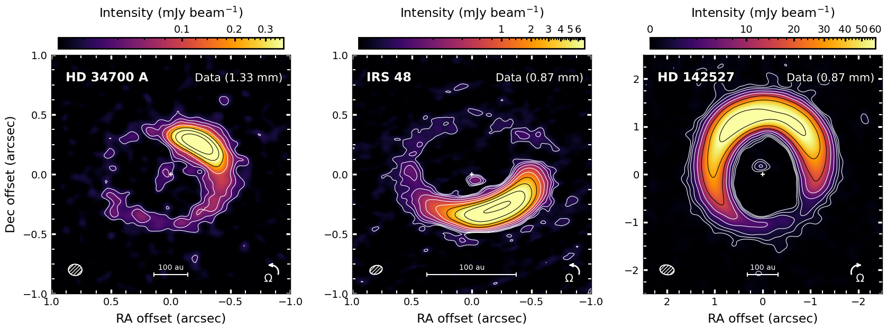
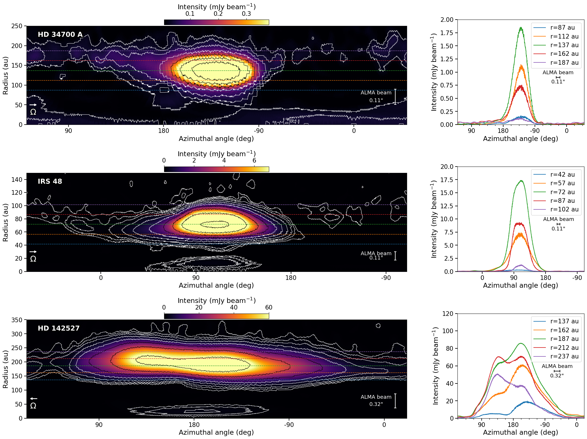
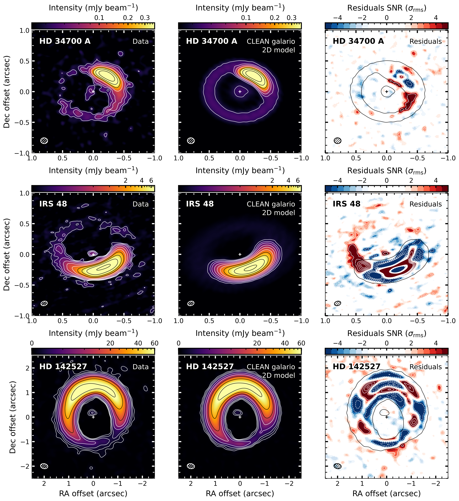

$\newcommand{\ensuremath}{}$
$\newcommand{\xspace}{}$
$\newcommand{\object}[1]{\texttt{#1}}$
$\newcommand{\farcs}{{.}''}$
$\newcommand{\farcm}{{.}'}$
$\newcommand{\arcsec}{''}$
$\newcommand{\arcmin}{'}$
$\newcommand{\ion}[2]{#1#2}$
$\newcommand{\textsc}[1]{\textrm{#1}}$
$\newcommand{\hl}[1]{\textrm{#1}}$
$\newcommand{\footnote}[1]{}$
$\newcommand{\Daniele}[1]{{\color{MidnightBlue}\textbf{DF}: #1}}$
$\newcommand{\Tomo}[1]{{\color{ForestGreen}\textbf{TY}: #1}}$
$\newcommand{\fsco}[1]{{\color{Orange}\textbf{fsco}: #1}}$
$\newcommand{\mb}[1]{\textcolor{cyan}{#1}}$
$\newcommand{\arraystretch}{1.5}$
$\newcommand{\arraystretch}{1.5}$
$\newcommand{\arraystretch}{1.5}$

# The Circumbinary Disc of HD 34700A: II. Analysis of a strong dust asymmetry

<mark>Appeared on: 2026-03-27</mark> -  _14 pages, 7 figures. Accepted for publication in A&A March 25, 2026_

<mark>D. Fasano</mark>, et al. -- incl., <mark>M. Benisty</mark>, <mark>F. Zagaria</mark>

**Abstract:** ALMA observations have shown that substructures are ubiquitous in protoplanetary discs. A sub-group, the transition discs, shows large cavities and rings in dust continuum. Among these, some present very high contrast asymmetries possibly due to the presence of vortices. HD 34700A is a binary system featuring a cavity, a ring, and multiple spiral arms detected in scattered light, a prominent crescent in the ALMA continuum and a complex gas morphology possibly connected with ongoing infall. We present new ALMA band 6 ( $1.3 \rm mm$ ) continuum images of the circumbinary disc around HD 34700A and compare them with two other systems showcasing high ( $\gtrsim30$ , measured as the peak-to-azimuthal-average ratio) contrast continuum asymmetries, IRS 48 and HD 142527. We aim to characterise the crescent morphology, discuss their possible origin, and, in the case of the vortex scenario, assess the efficiency of dust trapping in these systems. We perform visibility modelling of the new high resolution ( $0\farcs11\times0\farcs09$ ) ALMA band 6 continuum data of HD 34700A, together with improved visibility modelling of the other two targets. We detect a $0\farcs46$ ( $161 \rm au$ ) large cavity and resolve a ring with an asymmetric crescent and an extended tail at $0\farcs53$ ( $186 \rm au$ ) with peak intensity of $1.9 \rm mJy beam^{-1}$ , corresponding to the second highest contrast ( $\sim$ 62) ever detected with ALMA in a protoplanetary disc. We also detect unresolved emission inside the cavity, that we attribute to an  inner disc. Our visibility model is in remarkable agreement with the HD 34700A data, featuring only localised residuals in the region of the disc corresponding to the tail of the asymmetry. For HD 142527, we obtain a very good overall agreement with the data, recovering both the double peaked asymmetric ring and the inner disc emission. In the case of IRS 48 we recover the general morphology of the asymmetry, but we cannot reproduce the fainter ring. We then run a hydrodynamic model of a vortex with different dust fluids, reproducing the general morphology observed in the HD 34700A and IRS 48 systems, with the emission around the vortex showing a mild asymmetry between the leading and trailing sides. With a combination of visibility, dust evolution and hydrodynamical models, we have constrained the morphology of the dust continuum emission of HD 34700A for the first time, and improved existing models for IRS 48 and HD 142527. The high azimuthal contrast of the asymmetries rules out the orbit clustering of eccentric cavities scenario, while the dust evolution models we consider suggest that the vortex scenario is a plausible option.

**Figure 4. -** Continuum images of HD 34700 A (left), IRS 48 (middle) and HD 142527 (right). The white/black contours are taken at $3\sigma$, $5\sigma$ and $2^n\sigma$, with integer numbers $n\geq3$. The white plus sign marks the centre of the ring in the \texttt{galario} model, the ellipse in the bottom left corner represents the synthesised beam and the arrow in the bottom right corner shows the direction of the gas rotation. We apply an asinh stretch from $\{0.007, 0.007, 0.000\} \rm mJy beam^{-1}$ to a factor $\{0.2, 0.4, 0.7\}$ of the peak intensity, using a stretch parameter of $\{0.1, 0.01, 0.1\}$ to the colour scale to visually enhance the fainter emission. (*fig:Continuum gallery*)

**Figure 5. -** Left column: de-projected continuum images of HD 34700 A (top), IRS 48 (middle) and HD 142527 (bottom) in polar coordinates. Contours are the same as in Figure \ref{fig:Continuum gallery}. In the bottom left corner we show the rotation direction of the gas, while in the bottom right corner we show the beam size in the radial direction. Right column: Azimuthal profiles of the de-projected continuum images from the left column, taken at different radii around the peak location, corresponding to the dashed lines with the same colours in the left column. We use the \texttt{savgol\_filter} function of the \texttt{scipy}\citep{Virtanen_2020} module to smooth the oscillations introduced by the interpolation on the polar grid. We also show the ALMA beam size associated to the azimuthal profile evaluated at the peak radius. The plots have been shifted azimuthally so that the image peak is in the centre and the $-180◦ee$ azimuth coincide with the $180◦ee$ azimuth. (*fig:Azimuthal plots*)

**Figure 6. -** Top to bottom: Images of HD 34700 A; IRS 48; HD 142527. Left to right: Continuum images, same as in Figure \ref{fig:Continuum gallery}; CLEANed \texttt{galario} model images; CLEANed residual images; In the left and middle columns, contours are the same as in Figure \ref{fig:Continuum gallery}. In the right column, white solid (positive) and dashed (negative) contours start at $3\sigma$ and $5\sigma$, and increase by $5\sigma$, while black contours correspond to the $3\sigma$ emission from the CLEANed model. (*fig:Summary plots*)

