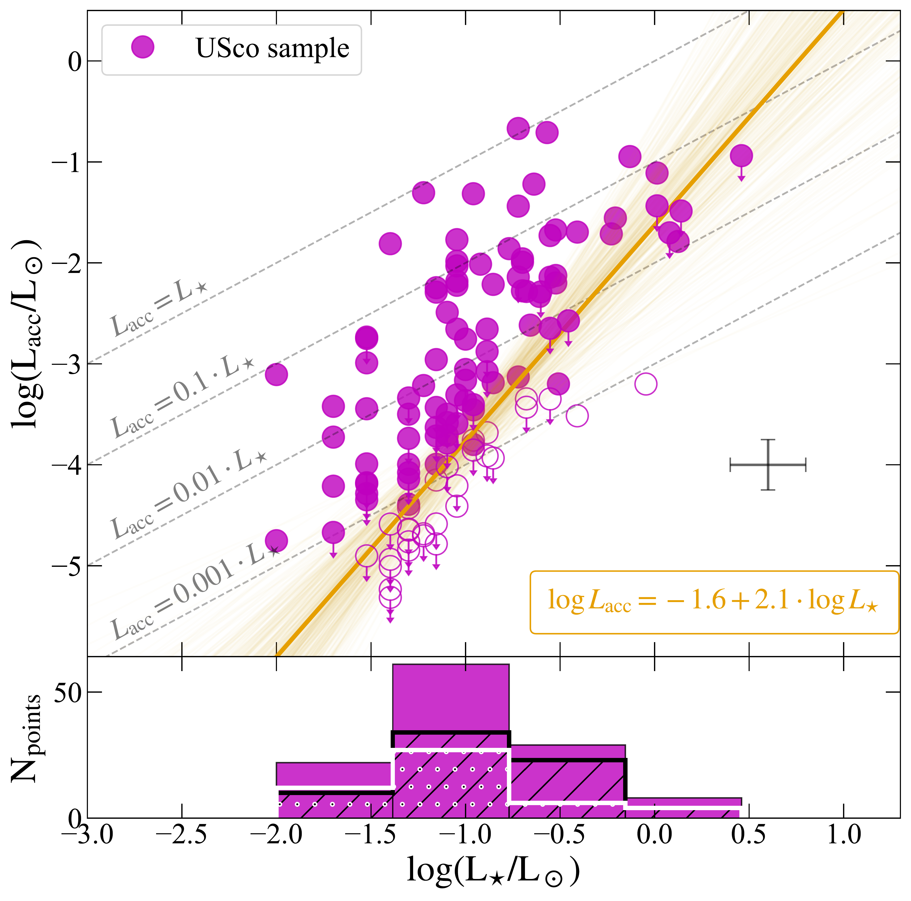
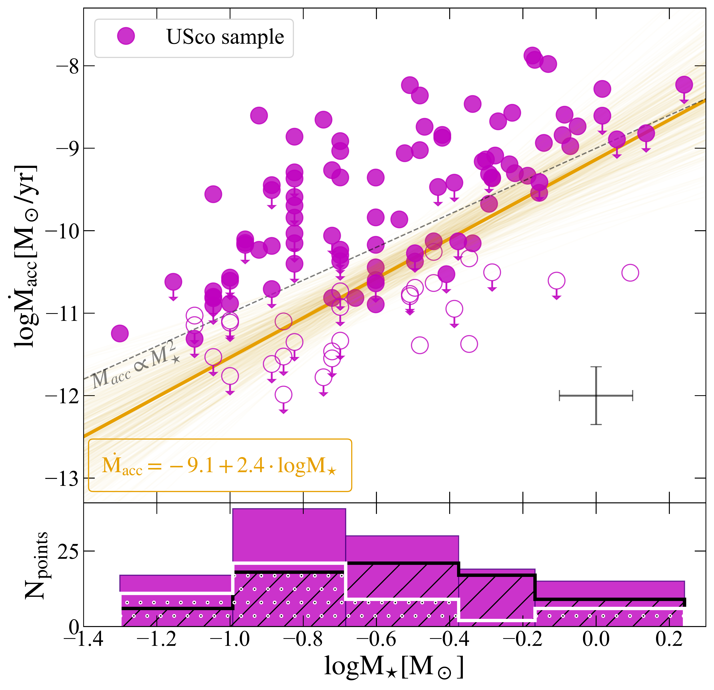
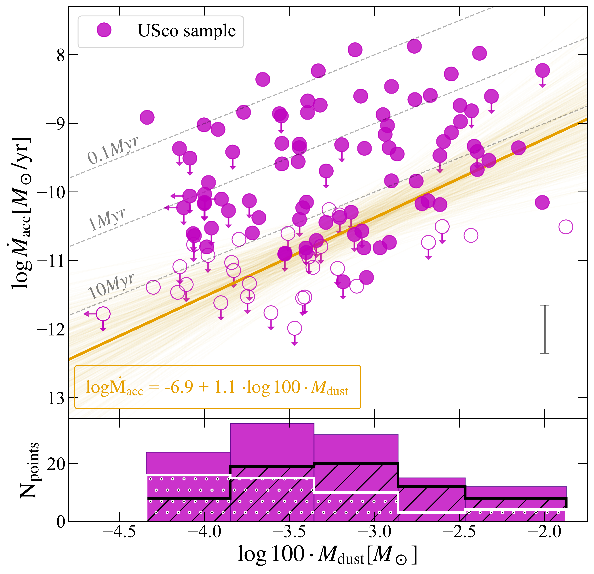

$\newcommand{\ensuremath}{}$
$\newcommand{\xspace}{}$
$\newcommand{\object}[1]{\texttt{#1}}$
$\newcommand{\farcs}{{.}''}$
$\newcommand{\farcm}{{.}'}$
$\newcommand{\arcsec}{''}$
$\newcommand{\arcmin}{'}$
$\newcommand{\ion}[2]{#1#2}$
$\newcommand{\textsc}[1]{\textrm{#1}}$
$\newcommand{\hl}[1]{\textrm{#1}}$
$\newcommand{\footnote}[1]{}$
$\newcommand{◦ee}{\ensuremath{^\circ}}$
$\newcommand{\Ll}{{L_{\rm line}}}$
$\newcommand{\LHa}{{L_{\rm H\alpha}}}$
$\newcommand{\Lacc}{{{L_{\rm acc}}}}$
$\newcommand{\Rco}{{R_{\rm CO}}}$
$\newcommand\cfm[1]{{\bf#1}}$
$\newcommand\mstar{{M_\star}}$
$\newcommand\teff{T_{\rm eff}}$
$\newcommand\macc{{\dot{M}_{\rm acc}}}$
$\newcommand\lacc{{L_{\rm acc}}}$
$\newcommand\mdust{{M_{\rm dust}}}$
$\newcommand\mdisc{{M_{\rm disc}}}$
$\newcommand\halpha{H\alpha}$
$\newcommand{\halphaten}{H\alpha_{10\%}}$
$\newcommand\kms{\ts km\ts s^{-1}}$
$\newcommand\msun{{M_{\odot}}}$
$\newcommand\lsun{{L_{\odot}}}$
$\newcommand\lstar{{L_\star}}$
$\newcommand\lline{{L_{\rm line}}}$
$\newcommand\maccnoise{\dot{M}_{\rm acc,noise}}$
$\newcommand\laccnoise{L_{\rm acc,noise}}$
$\newcommand\nodata{...}$

# X-Shooter survey of disk accretion in Upper Scorpius$\thanks{Based on observations collected at the European Southern Observatory under ESO programmes 097.C-0378(A), 0101.C-0866(A), 113.26NN.001, 113.26NN.003, 115.27XL.001, and 105.2082.003. }$: II. A lack of correlation between accretion rates and disk properties

<mark>Appeared on: 2026-06-19</mark> -  _Accepted for publication in Astronomy and Astrophysics (A&A)_

A. Empey, et al. -- incl., <mark>F. Zagaria</mark>

**Abstract:** The evolution of protoplanetary discs is intertwined with the process of planet formation, growth and migration. Studies of nearby star forming regions of different ages and properties provide the necessary information needed to understand the processes dictating their evolution. This paper presents the results of a spectroscopic study of the stellar and accretion properties of a large sample of 127 stars with protoplanetary discs in the Upper Scorpius region, a relatively old (5-10 Myr), nearby ( $\sim 145$ pc) star-forming region, with disc dust masses inferred from ALMA continuum measurements. The accretion luminosity is derived from the excess UV continuum emission with respect to the photospheric and chromospheric one self-consistently with the stellar spectral types, extinction and luminosity, using the FRAPPE code. We apply a new method to evaluate upper limits to the accretion luminosity. In $\sim$ 50 \% of cases we can only evaluate upper limits on the accretion luminosity, either because the signal-to-noise of the data is insufficient or because the measured value of the accretion luminosity is below the statistical estimate of the emission due to chromospheric activity. The results show that the mass accretion rate has a weak correlation with the stellar mass, while no correlation is observed with disc properties such as dust mass or gaseous disc radius. The dispersion is larger than what is found in younger star forming regions such as Lupus and Chamaeleon I, and suggests a fading of the correlations with age. We find no evidence that membership to Upper Scorpius sub-groups, nor the properties of the known binary systems or transition discs can explain the origin of the observed dispersion. The lack of a correlation and the large dispersion of accretion rates challenge the current expectations of evolutionary models. The observed properties point to a decoupling of the inner and outer disc by the age of Upper Scorpius and a fading of the relations observed in younger star forming regions, which calls for development of the current theoretical frameworks to be explained.

**Figure 3. -** Top panel: Accretion luminosity (\lacc) plotted as a function of stellar luminosity (\lstar). Magenta solid points are definite accretors, those with downward pointing arrows have upper limit measurements based on their continuum excess. Hollow magenta points represent those targets whose values of $L_{\rm acc}/L_\star$ ratio, are below that of the chromospheric limit (see Fig. \ref{fig: chromo_limit}). Over plotted in orange is the best fit power-law determined by _linmix_, with the expression displayed in the textbox (see Table \ref{tab: linmix_params} for full fit parameters and uncertainties). Coloured faded lines are sample fits taken from the Bayesian posterior  ([ and Kelly 2007](https://ui.adsabs.harvard.edu/abs/2007ApJ...665.1489K)) . Dashed grey lines show different fixed dependencies of \lacc on \lstar to guide the eye. The grey cross represents typical uncertainties on the values of \lacc, \lstar. Bottom panel: histograms of the full sample (magenta), upper limit accretors (white dotted), and definite accretors (black striped) in each \lstar  bin.  (*fig: lacc_lstar*)

**Figure 4. -** Top panel: Mass accretion rate (\macc) plotted as a function of stellar mass (\mstar). Symbols and power-law fit as in Fig. \ref{fig: lacc_lstar}. The dashed grey line shows the \macc$\propto M_{\star}^2$ relation to guide the eye. The grey cross represents typical uncertainties on the values of \macc, \mstar. Bottom panel: histograms of the full sample (magenta), upper limit accretors (white dotted), and definite accretors (black striped) in each \mstar bin. (*fig: macc_mstar*)

**Figure 5. -** Top panel: Mass accretion rate (\macc) plotted as a function of disc mass (\mdisc). Symbols and power-law fit as in Fig. \ref{fig: lacc_lstar}. The dashed grey lines represent \mdisc/\macc ratios of 0.1, 1, and 10 Myr. The grey error bar represents the typical uncertainty on the values of \macc. Bottom panel: histograms of the full sample (magenta), upper limit accretors (white dotted), and definite accretors (black striped) in each \mdisc bin.  (*fig: macc_mdisc*)

