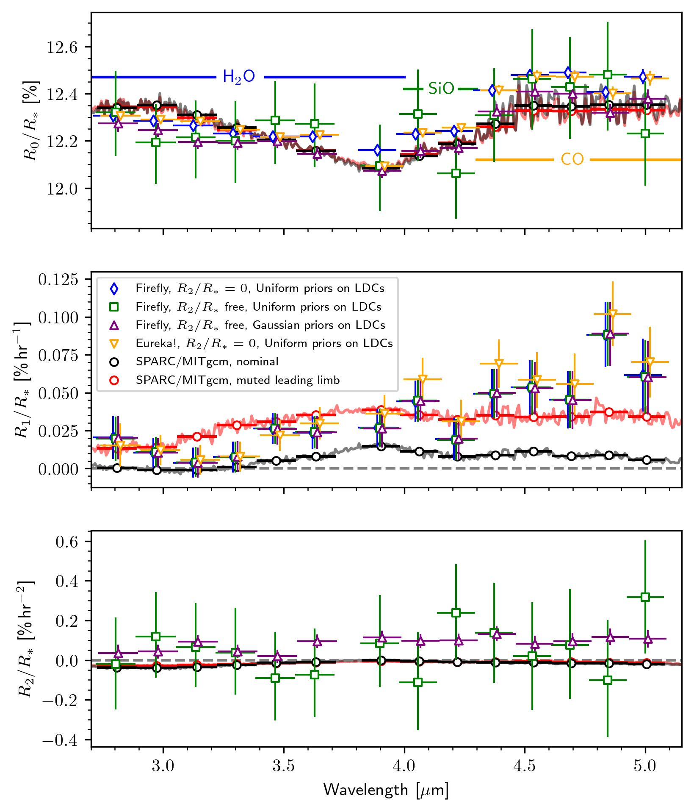
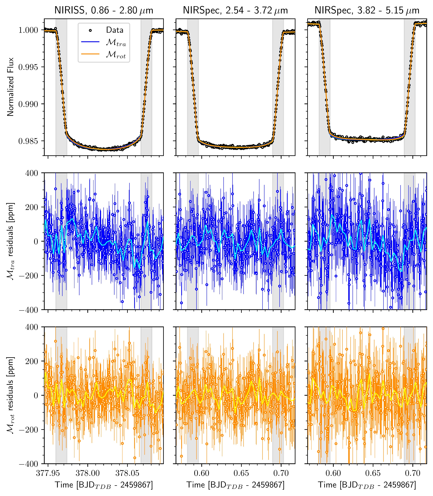
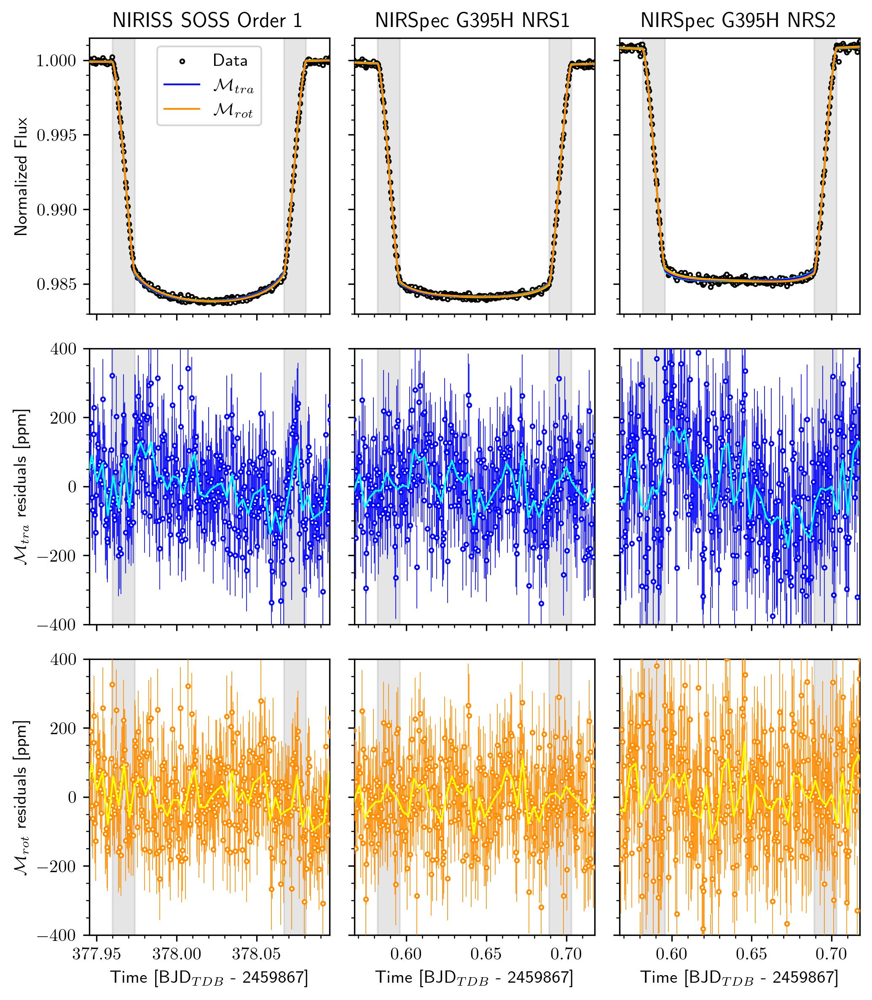

$\newcommand{\ensuremath}{}$
$\newcommand{\xspace}{}$
$\newcommand{\object}[1]{\texttt{#1}}$
$\newcommand{\farcs}{{.}''}$
$\newcommand{\farcm}{{.}'}$
$\newcommand{\arcsec}{''}$
$\newcommand{\arcmin}{'}$
$\newcommand{\ion}[2]{#1#2}$
$\newcommand{\textsc}[1]{\textrm{#1}}$
$\newcommand{\hl}[1]{\textrm{#1}}$
$\newcommand{\footnote}[1]{}$
$\newcommand\figurename{Extended Data Fig.}$
$\newcommand\tablename{Extended Data Table}$

# Atmospheric asymmetries in WASP-121 b revealed by rotational transits detected with JWST

<mark>Appeared on: 2026-06-19</mark> -  _33 pages, 10 figures, 2 tables, including Extended Data. Published in Nature Astronomy. Algorithms for fitting light curves used in this work are available at this https URL_

<mark>C. Gapp</mark>, et al. -- incl., <mark>E.-M. Ahrer</mark>

**Abstract:** Close-in exoplanets are tidally locked to their host star and thus exhibit extreme atmospheric temperature gradients. It has been theorized that the fraction of star light absorbed by such planets during transit changes as a function of orbital phase as progressively hotter or colder atmospheric gas rotates into view, but this effect has not been observed so far. Here, we show that two transits of the ultra-hot Jupiter WASP-121 b, acquired with JWST/NIRSpec and NIRISS, exhibit asymmetric transit light curves caused by the planet's rotation during transit. We observe increasing CO absorption and slightly decreasing $H_2$ O absorption in the transmission spectrum, as the planet rotates. These results are indicative of a stronger longitudinal temperature gradient across the evening than across the morning terminator, consistent with higher temperatures in the eastern half than in the western half of the dayside. The observed changes of the transmission spectrum with orbital phase are in line with the temperature increase causing thermal dissociation of $H_2$ O, while CO remains abundant. The observation of longitudinal gradients of atmospheric temperature and chemistry from the planet's rotational transit provides a new probe for constraining atmospheric heterogeneity using JWST beyond differences between morning and evening terminators from limb asymmetries.

**Figure 8. -** WASP-121 b's radius polynomial coefficients (see Eq. \ref{eq:Rp}) as functions of wavelength measured using the JWST/NIRSpec G395H observations and modeled using SPARC/MITgcm. Colored diamonds, squares and triangles indicate the medians of 125,000 posterior samples from the spectroscopic light curve fits with different assumptions about $R_p/R_*(t)$ and modeling approaches for the limb darkening coefficients (LDCs) and using one of the two data reductions. All markers' horizontal bars indicate the wavelength ranges of the spectroscopic light curve channels and vertical error bars show the $1 \sigma$ range of the 150,000 posterior samples. The data were slightly offset to each other horizontally for increased visibility. Solid lines show the model predictions at a spectral resolution of $R\sim 600$ and dots represent the model values binned into the same wavelength bins as the observations. In the upper panel, the model spectra were subtracted by a constant value so that their and Firefly's $R_2/R_*=0$ observations' mean between $2.7$ and $4.0 \mu$m match. Dashed grey lines at zero were added to guide the eye. (*fig:spectrum*)

**Figure 1. -** WASP-121 b's white transit light curves observed with JWST/NIRISS SOSS and JWST/NIRSpec G395H. Both observations have been reduced with Firefly. The first row shows the raw light curves integrated over NIRISS's first grating order and NIRSpec's NRS1 and NRS2 detectors together with the maximum-likelihood translational ($\mathcal{M}_{\rm{tra}}$) and rotational ($\mathcal{M}_{\rm{rot}}$) models inferred from a Markov-Chain Monte Carlo (MCMC) sampling of the posterior probability. Circles depict the fluxes per integration normalized by the median fluxes measured during the secondary eclipse observed before the transit and error bars depict the $1\sigma$ intervals measured from 150,000 posteriors samples of the light curve (see Methods). Transparent cyan and yellow lines depict models calculated from 100 samples randomly drawn from the MCMC chains of $\mathcal{M}_{\rm{tra}}$ and $\mathcal{M}_{\rm{rot}}$, respectively. The second and third rows show the residuals between the maximum-likelihood models and the data. Vertical gray lines mark contact points 1, 2, 3, and 4 calculated from the planet's orbital parameters and radius winn10 with gray shaded regions indicating the times of ingress and egress. (*fig:white-lightcurve*)

**Figure 4. -** WASP-121 b’s white transit light curves observed with JWST/NIRISS SOSS and JWST/NIRSpec G395H. The same as Fig. \ref{fig:white-lightcurve}, but using the Fu reduction of the JWST/NIRISS observations and the Eureka! reduction of the JWST/NIRSpec observations. (*fig:white-lightcurve_eureka*)

